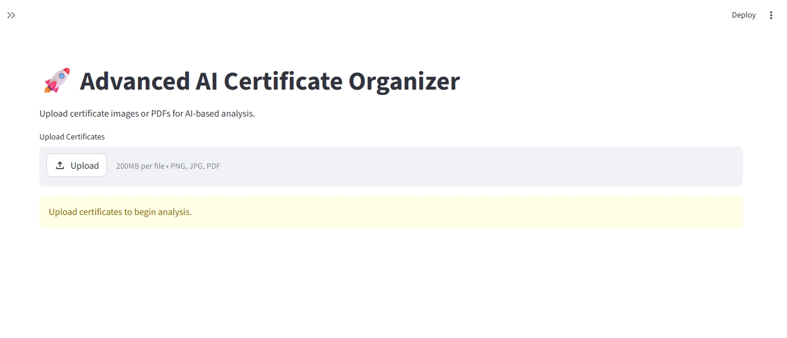
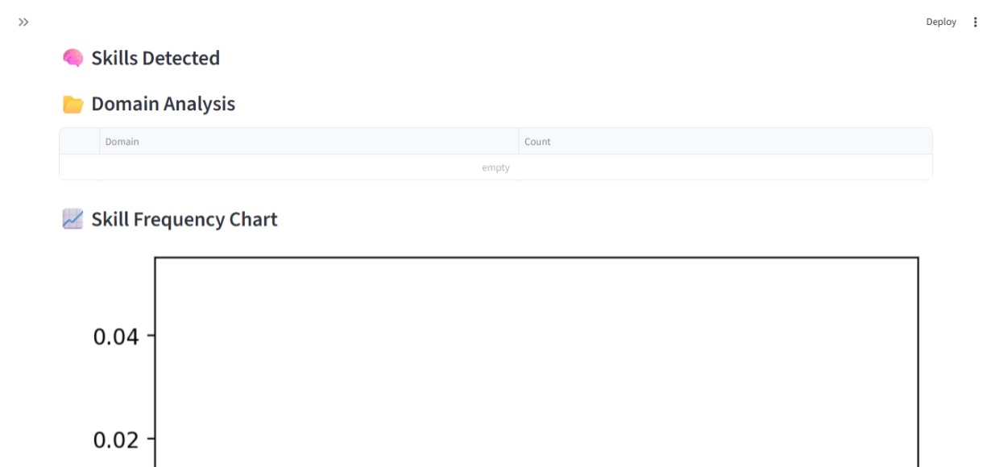
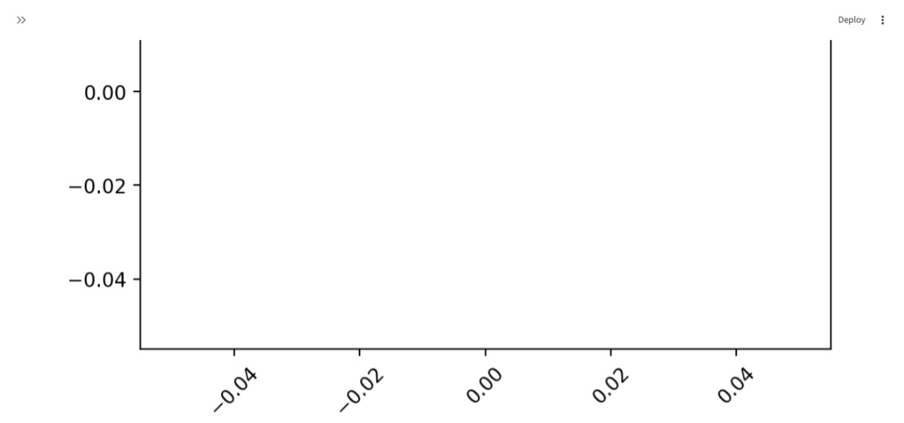
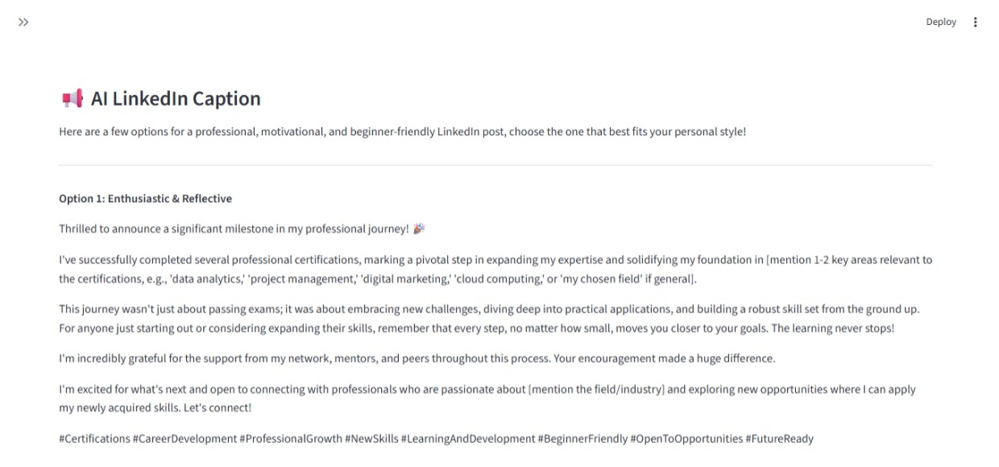
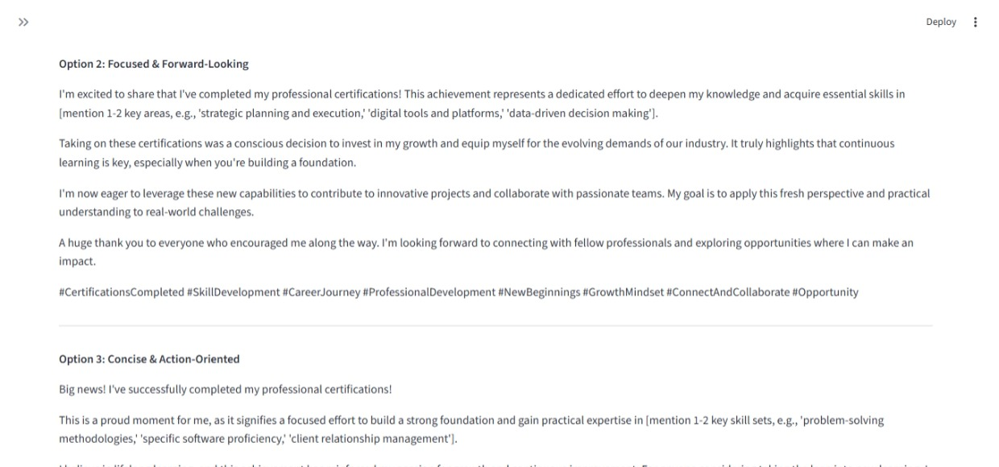
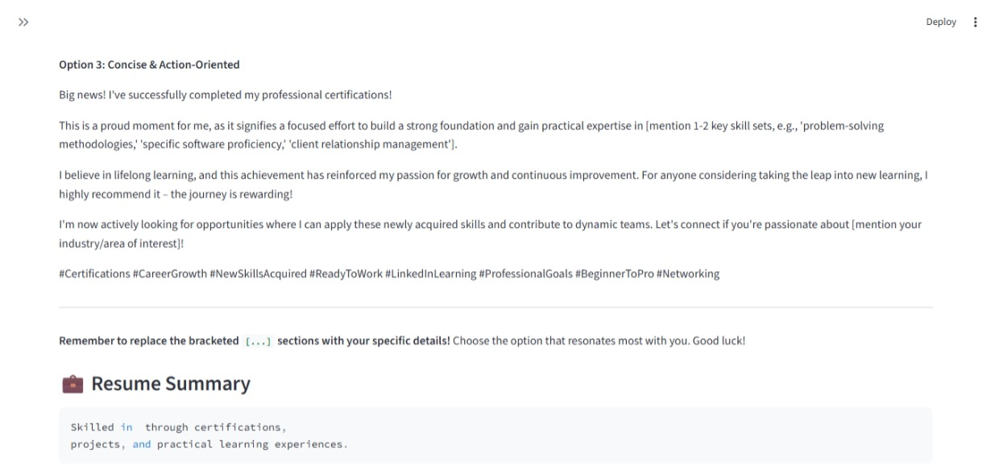

# AI Certificate Organizer


An AI-powered certificate analysis platform that extracts skills from certificates, categorizes them into domains, generates professional LinkedIn captions, creates resume summaries, and provides career recommendations using OCR and Generative AI.

## Project Overview

Managing multiple certificates and identifying acquired skills manually can be time-consuming. This project automates the process by extracting text from certificate images and PDFs, analyzing skills, and generating personalized career insights.

## Key Features

- OCR-based text extraction from certificate images
- PDF certificate processing
- Automatic skill detection and categorization
- Interactive analytics dashboard
- Skill frequency visualization
- AI-generated LinkedIn post suggestions
- Resume summary generation
- Career recommendations
- AI Readiness Score evaluation

## Technology Stack

| Technology       | Purpose            |
| ---------------- | ------------------ |
| Python           | Core Programming   |
| Streamlit        | Web Application    |
| Tesseract OCR    | Text Extraction    |
| PDFPlumber       | PDF Processing     |
| Pandas           | Data Analysis      |
| Matplotlib       | Data Visualization |
| Google Gemini AI | Content Generation |

## Project Workflow

1. Upload certificate images or PDFs
2. Extract text using OCR
3. Detect technical skills
4. Categorize skills into domains
5. Visualize analytics and trends
6. Generate LinkedIn captions
7. Generate resume summaries
8. Provide career recommendations

## Screenshots

### Dashboard

Add screenshot here:



### Skill Analysis

Add screenshot here:




### LinkedIn Caption Generator

Add screenshot here:





## Installation

Clone the repository:

```bash
git clone https://github.com/sivadharanG/AI-Certificate-Organizer.git
```

Navigate to the project directory:

```bash
cd AI-Certificate-Organizer
```

Install dependencies:

```bash
pip install -r requirements.txt
```

Create a `.env` file:

```env
GEMINI_API_KEY=your_api_key
```

Run the application:

```bash
streamlit run app.py
```

## Sample Output

### Skills Detected

- Python
- Machine Learning
- Data Science
- Generative AI
- Streamlit

### Career Recommendations

- Machine Learning Engineer
- Data Scientist
- Generative AI Developer
- Python Developer

## Future Enhancements

- Certificate authenticity verification
- Resume generation from certificates
- Skill gap analysis
- AI-powered learning roadmap
- Certificate database management
- Export reports as PDF

## Author

**Sivadharan G**

B.Sc Artificial Intelligence & Machine Learning

VLB Janakiammal College of Arts and Science

GitHub: https://github.com/sivadharanG

## Repository Link

# https://github.com/sivadharanG/AI-Certificate-Organizer
